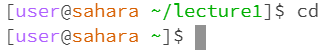
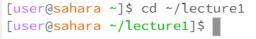
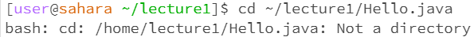
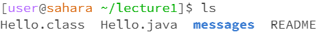
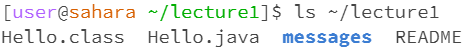
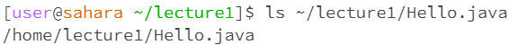
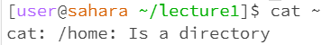
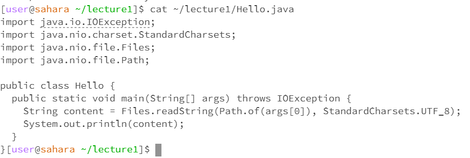

## Karthik Srinivasan's CSE 15L Lab 1 Submission

*Linux Terminal*

**cd**

When inputting cd without any arguments,the terminal navigates to the previous directory by default. The working directory when the command was run was lecture1. After the command was run the working directory changed to the previous 
overarching directory: home. This is not an error.

When inputting cd with an argument of a path of a directory, the terminal navigates to the respective directory. In the example, when the command was run the working directory was home. After the command was run, the working directory was the directory in the argument of the command, lecture1. This is not an error.

When inputting cd with an argument of a path of a file, the terminal outputs an error and nothing is done. In the example, when the command was run the working directory was home. After the command, the working directory was unaltered. This is because it does not make sense to change the working directory to a file, as a file is not a terminal. Hence, the command is an error.

**ls**

When inputting ls without any arguments,the terminal lists the files and folders in the current working directory. The working directory when the command was run was lecture1. After the command, the working directory did not change. This is not an error.

When inputting ls with an argument of a path of a directory, the terminal lists the files in the respective directory. In the example, when the command was run the working directory was lecture1. After the command was run, the working directory did not change. The terminal just listed the files under the argument directory. This is not an error.

When inputting ls with an argument of a path of a file, the terminal outputs the same path of the file. In the example, when the command was run the working directory was lecture1. After the command, the working directory was unaltered. ls never changes the working directory of the terminal. Nonetheless, in the case of the file being an argument, it outputs the path of the file as a file is not a directory. This is not an error.

**cat**

When inputting cat without any arguments, the terminal waits for more input and goes into a loop. The working directory when the command was run was lecture1. After the command, the working directory did not change. This is an error.

When inputting cat with an argument of a path of a directory, the terminal produces an error stating that the argument is a directory. In the example, when the command was run the working directory was lecture1. After the command was run, the working directory did not change. Cat is used to edit files and not directories. Hence, it cannot do anything when the home directory is entered as an argument above. This is an error.

When inputting cat with an argument of a path of a file, the terminal outputs the contents the file. In the example, when the command was run the working directory was lecture1. After the command, the working directory was unaltered. cat never changes the working directory of the terminal. Nonetheless, in the case of the file being an argument, it outputs the contents of the file. This is not an error.
