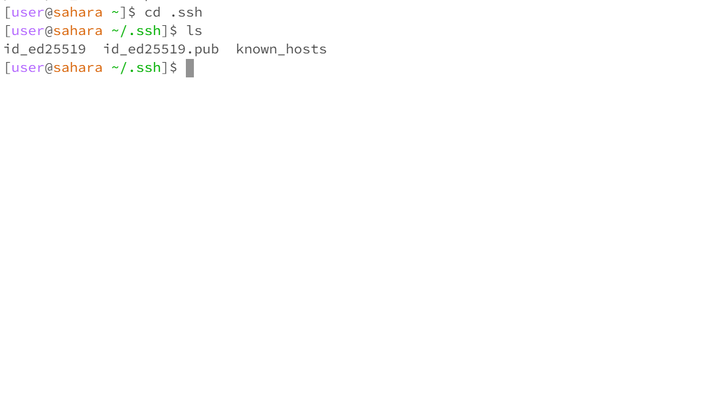

## Karthik Srinivasan's CSE 15L Lab 1 Submission

*Part 1*

**Code for StringServer.java**

    import java.io.IOException;
    import java.net.URI;
    
    class Handler implements URLHandler {
        // The one bit of state on the server: a number that will be manipulated by
        // various requests.
        String contents="";
        int num = 0;
    
        public String handleRequest(URI url) {
            if (url.getPath().equals("/")) {
                return contents;
            } else {
                if (url.getPath().contains("/add-message")) {
                    String[] parameters = url.getQuery().split("=");
                    if (parameters[0].equals("s")) {
                        num += 1;
                        contents = contents + "\n" + num + ". " + parameters[1].replace("+", " ");
                        return contents;
                    }
                }
                return "404 Not Found!";
            }
        }
    }
    
    
    class StringServer {
        public static void main(String[] args) throws IOException {
            if(args.length == 0){
                System.out.println("Missing port number! Try any number between 1024 to 49151");
                return;
            }
    
            int port = Integer.parseInt(args[0]);
    
            Server.start(port, new Handler());
        }
    }

The above screenshot shows the use of add-message to add a line that says "Hello". Entering the URL on the search bar triggers the handleRequest() method in the Handler class. The relevant argument is the URL itself. The relevant fields in the class Handler are num and contents which are set to 0 and "" respectively at the time of this method call. After the method call, num changes to 1 and contents changes to "\n1. Hello". 

The above screenshot shows the use of add-message to add a line that says "How are you". Entering the URL on the search bar triggers the handleRequest() method in the Handler class. The relevant argument is the URL itself. The relevant fields in the class Handler are num and contents which are set to 1 and "1. Hello" respectively at the time of this method call. After the method call, num changes to 2 and contents changes to "\n1. Hello\n2. How are you". 

*Part 2*

The above picture shows the file id_ed25519 listed in the .ssh directory on the home computer.

The above picture shows the file authorized_keys listed in the .ssh directory in the remote computer.

The above picture shows my login to the ieng6 computer without the password being prompted.

*Part 3*

I have used ssh before but I have never learned about keys and such as seen in part 2. I have never used Java web servers before so it was interesting to see that. Otherwise, I am somewhat familiar with the material being taught in class.

