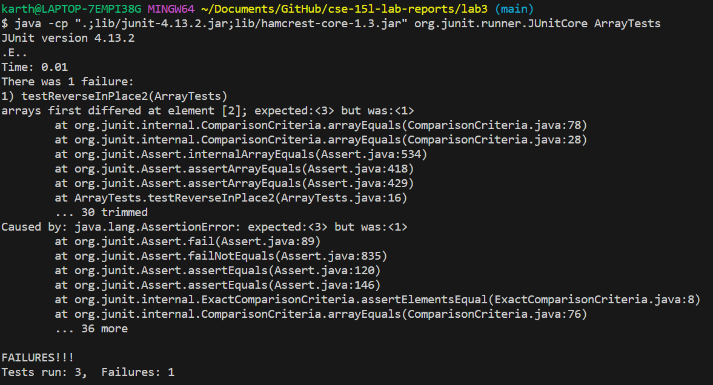

## Karthik Srinivasan's CSE 15L Lab 3 Submission

*Part 1*

The bug that we will explore is ArrayExamples' inability to perform the reverseInPlace function.

The following test fails.

	  @Test 
		public void testReverseInPlace2() {
	    int[] input1 = { 3, 2, 1 };
	    ArrayExamples.reverseInPlace(input1);
	    assertArrayEquals(new int[]{ 1, 2, 3 }, input1);
		}

The following test does not fail.

		@Test 
		public void testReverseInPlace() {
	    int[] input1 = { 3 };
	    ArrayExamples.reverseInPlace(input1);
	    assertArrayEquals(new int[]{ 3 }, input1);
		}
  
The following is the symptom as the test result of the buggy code.

The following is the buggy code.

	  static void reverseInPlace(int[] arr) {
	    for(int i = 0; i < arr.length; i += 1) {
	      arr[i] = arr[arr.length - i - 1];
	    }
	  }

The following is the code after bug-removal.

	static void reverseInPlace(int[] arr) {
	  for (int i = 0; i < arr.length / 2; i++) {
	    int temp = arr[i];
	    arr[i] = arr[arr.length - i - 1];
	    arr[arr.length - i - 1] = temp;
	  }
	}

The problem with the previous code was that the array was being iterated over while its elements were being swapped. Consequently, elements were being duplicated. The second method only goes through half the array and assigns an iteration that is about to be deleted to temp. This prevents duplication of iterations and lost data.

*Part 2*

The command that I will be exploring is the find command. I have used this (https://www.youtube.com/watch?v=skTiK_6DdqU) YouTube video to learn about the command.

The first argument I will be exploring is name.

Consider the following command.

	find -name chapter-1.txt

Output: 

	./911report/chapter-1.txt
 
 The command takes the name of the file that needs to be found and outputs the path of the file relative to the current working directory. This is useful in locating files.

 Consider the second command.

	 find ./911report -name *.txt

  Output:

	 ./911report/chapter-1.txt
	./911report/chapter-10.txt  
	./911report/chapter-11.txt  
	./911report/chapter-12.txt  
	./911report/chapter-13.1.txt
	./911report/chapter-13.2.txt
	./911report/chapter-13.3.txt
	./911report/chapter-13.4.txt
	./911report/chapter-13.5.txt
	./911report/chapter-2.txt
	./911report/chapter-3.txt
	./911report/chapter-5.txt
	./911report/chapter-6.txt
	./911report/chapter-7.txt
	./911report/chapter-8.txt
	./911report/chapter-9.txt
	./911report/preface.txt

 The previous command finds all the .txt files in the directory 911 report which exists under technical. This is useful when the all the files of a certain type must be found.

 The second argument in find that I will be exploring is the -type argument.

 The type argument is very useful for finding all the files or directories in the current directory. Consider the following code.

	 find . -type d

Output:

	.
	./911report
	./biomed
	./government
	./government/About_LSC
	./government/Alcohol_Problems
	./government/Env_Prot_Agen
	./government/Gen_Account_Office
	./government/Media
	./government/Post_Rate_Comm
	./plos

The previous command found all the subdirectories to the current working directory (technical). This is useful as it shows where one can change directories into.

Another example of the -type argument in the find command is as follows:

	find 911report -type f

 Output:

	 911report/chapter-1.txt
	911report/chapter-10.txt
	911report/chapter-11.txt
	911report/chapter-12.txt
	911report/chapter-13.1.txt
	911report/chapter-13.2.txt
	911report/chapter-13.3.txt
	911report/chapter-13.4.txt
	911report/chapter-13.5.txt
	911report/chapter-2.txt
	911report/chapter-3.txt
	911report/chapter-5.txt
	911report/chapter-6.txt
	911report/chapter-7.txt
	911report/chapter-8.txt
	911report/chapter-9.txt
	911report/preface.txt

 The above command finds all the files in the folder 911report. This is useful for navigating and maintaining a directory.

 The next command line option for find I will explore is the -exec option.

 The exec option executes a command on the files found. Consider the following command.

	 find 911report/ -type f -exec cat {} +
  
  The output for this command is too long but essentially it applies the cat command to every file found in the 911report/ directory. Consequently, every file in the 911report directory is printed to the terminal. This is very useful in order to read multiple different files in the same directory.
