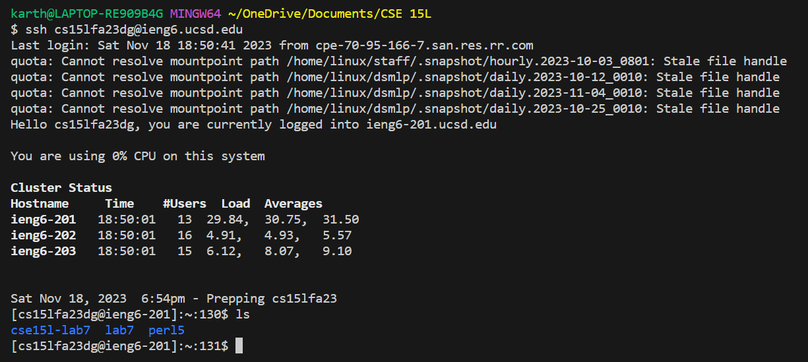
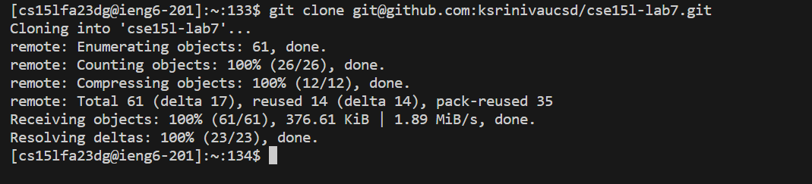
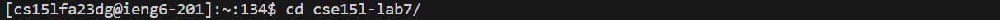
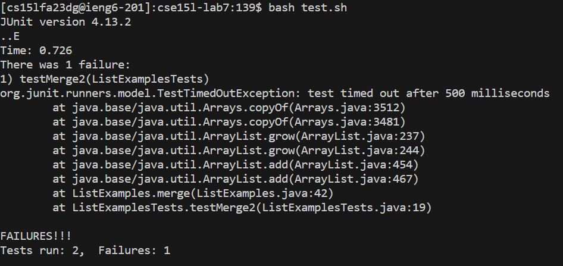
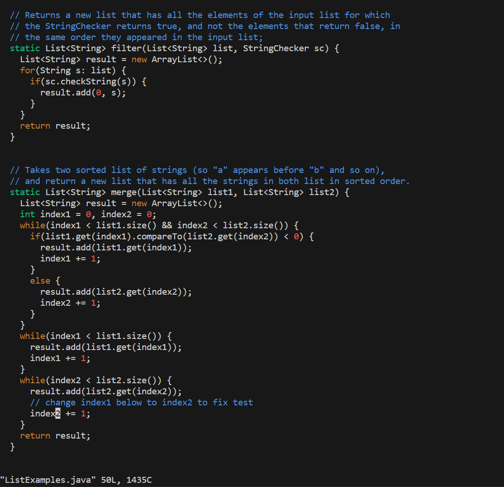
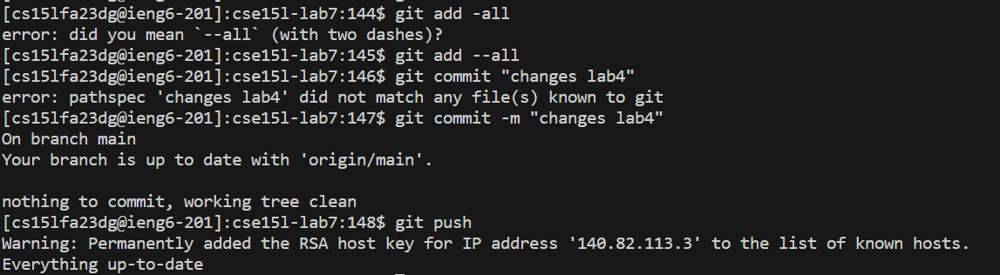

**Karthik Srinivasan's CSE 15L Lab 4 Submission**

**Step 4**

I logged into ieng6 by pressing the keys 

~~~
ssh cs15lfa23dg@ieng6.ucsd.edu<Enter>
~~~

I already had the public key set up so I did not have to press more keys to enter the passcode.

**Step 5**

I pressed 
  <Alt> + <tab>

Then I pressed 

  <ctrl> + <c>
  
to copy the url from github which contains the ssh URL for the GitHub repo.

I then pressed the keys below to paste the ssh URL for the GitHub repo and clone the repository.

~~~
<Alt> + <tab> git clone <ctrl> + <v> <Enter>
~~~

**Step 6**

I pressed the following keys to enter the cloned repository.

  cd cs <Tab> <Enter>

I pressed the keys *bash test.sh* and <Enter> to run the tests and they failed.

**Step 7**

I typed in *vim L* <Tab> and . <Tab> and <Enter> to enter ListExamples.java.

I pressed the <down> 41 times and the <right> 11 times. I then pressed <x>, followed by <i>, and then <2>.

This changed ListExamples.java to the right file.

**Step 8**

I pressed the <up> twice and <Enter> to run test.sh. The tests ran successfully.

**Step 9**

I typed *git add --all* and <Enter>. Followed by *git commit -m "changes lab4"* and <Enter>. Followed by *git push* and <Enter>.

There was nothing to commit as I had already committed these changes before during lab and forgot to take a screenshot.

