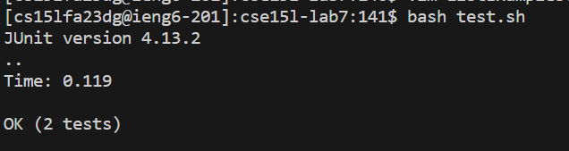

**Karthik Srinivasan's CSE 15L Lab 4 Submission**

*Step 4*

I logged into ieng6 by pressing the keys ssh cs15lfa23dg@ieng6.ucsd.edu and [Enter]

I already had the public key set up so I did not have to press more keys to enter the passcode.

*Step 5*

I pressed the keys git clone and I pressed [ctrl] + [c] followed by [ctrl] + [v] to copy and paste the ssh URL for the GitHub repo and [Enter].

*Step 6*

I pressed cd followed by cs [Tab] and [Enter] to enter the cloned directory.

I pressed the keys bash test.sh and [Enter] to run the tests and they failed.

*Step 7*

I typed in vim L [Tab] and . [Tab] and [Enter] to enter ListExamples.java.

I pressed the down key 41 times and the right key 11 times. I then pressed x, followed by i, and then 2.

This changed ListExamples.java to the right file.

*Step 8*

I pressed the up arrow twice and [Enter] to run test.sh. The tests ran successfully.

*Step 9*

I typed git add --all and [Enter]. Followed by git commit -m "changes lab4" and [Enter]. Followed by git push and [Enter].

There was nothing to commit as I had already committed these changes before during lab and forgot to take a screenshot.

