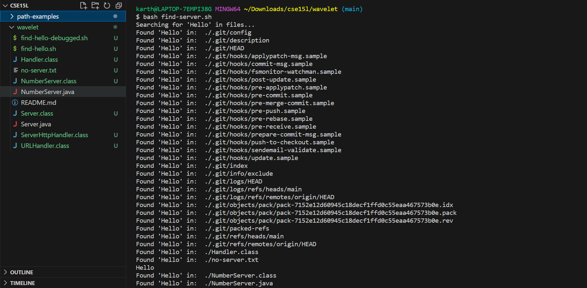
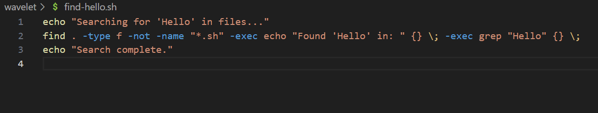
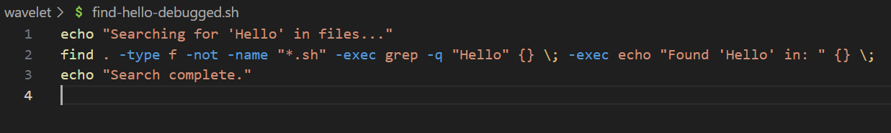
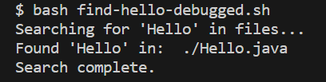

## Karthik Srinivasan's CSE 15L Lab 3 Submission

*Part 1 Student's Question*

Hi, I'm trying to create a bash file that finds all the non-bash files with the term "Hello" in them. I have created a bash file but it just causes all the non-bash files in my working directory to be listed as files with the term hello in them. I don't know what the issue is because I am using grep in the find command. Perhaps I should just remove the echo command in find?

I have attached a screenshot of my code output as well as my bash script.

*Part 2 TA's Response*

Hi! The echo command will be executed on each non-bash file found and then the grep command will be executed. Sounds like there's an issue with ordering here.

*Part 3 Student's Solution*

Hello! Thank you for your message. Looks like re-ordering fixed the issue! I also added a -q modifier to my grep command so that the exact line isn't printed, only the file that has the term "Hello." Thank you for helping me!

*Part 4*

The working directory is shown below. The only non-bash script file which contains the term "Hello" in it is Hello.java. This issue with find-hello.sh was that it printed out every non-bash script file found by find.

